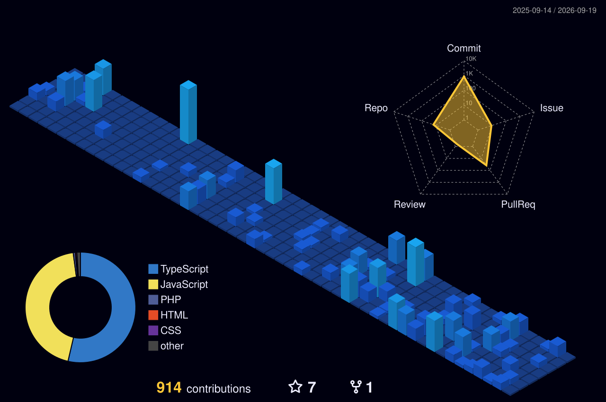

  

   

  

  

    <b>Full-Stack Web Developer</b> passionate about building scalable, high-performance web applications, monorepos, and AI-driven solutions. 
    Computer Science graduate at <b>Riau University</b> | Continuous Learner & Open Source Enthusiast.
  

  

    
    
    
  

---

## GitHub Trophies & Achievements

  

---

## Active Live Projects

<table>
  <tr>
    <td width="50%">
      <h3 align="center"><b>Retail Platform</b></h3>
      
<i>Modular E-Commerce & Point of Sale Monorepo</i>

      
High-performance modular retail and Point of Sale (POS) platform managed using Nx Monorepo following Clean Architecture and Domain-Driven Design (DDD) principles.

      

        <b>Tech Stack:</b> 
        
        
        
        
        
      

      

        <b>Highlights:</b> Multi-app Nx setup (Admin Dashboard, POS Terminal, Customer Portal), raw SQL connection pool, and centralized type sharing.
      

      

        <a href="https://github.com/kamaldev10/retail-platform"><b>[ Repository ]</b></a>
      

    </td>
    <td width="50%">
      <h3 align="center"><b>Judi Guard</b></h3>
      
<i>AI-Powered YouTube Gambling Spam Moderation System</i>

      
AI-powered web application for real-time detection and moderation of online gambling spam comments on YouTube. Built using Behaviour Driven Development (BDD) approach.

      

        <b>Tech Stack:</b> 
        
        
        
        
        
        
      

      

        <b>Highlights:</b> Monorepo architecture, YouTube Data API v3 integration, Hugging Face ML model API, and automated Cypress BDD testing.
      

      

        <a href="https://github.com/kamaldev10/judi-guard"><b>[ Repository ]</b></a>
      

    </td>
  </tr>
  <tr>
    <td width="50%">
      <h3 align="center"><b>Street Watch</b></h3>
      
<i>AI-Powered Pothole Monitoring System</i>

      
AI-powered pothole detection and road damage monitoring system designed for high-precision road infrastructure mapping.

      

        <b>Tech Stack:</b> 
        
        
        
        
      

      

        <b>Highlights:</b> Pothole image processing, geolocation tracking, and road condition analytics dashboard.
      

      

        <a href="https://github.com/kamaldev10/streetwatch-fullstack"><b>[ Repository ]</b></a>
      

    </td>
    <td width="50%">
      <h3 align="center"><b>Next.js Interactive Portfolio</b></h3>
      
<i>Personal Showcase & Case Studies Platform</i>

      
Personal interactive portfolio website built to showcase engineering projects, technical case studies, and articles dynamically.

      

        <b>Tech Stack:</b> 
        
        
        
      

      

        <b>Highlights:</b> High Lighthouse score, responsive UI, dynamic page routing, and clean design system.
      

      

        <a href="https://github.com/kamaldev10/nextjs-portofolio"><b>[ Repository ]</b></a>
      

    </td>
  </tr>
</table>

---

## Tech Stack & Capabilities

  
<b>Frontend Development</b>

   
  
  
  
  
  
  
  
  
  
  

  
<b>Backend & Database</b>

   
  
  
  
  
  
  
  
  

  
<b>Testing, DevOps & Deployment</b>

   
  
  
  
  
  
  
  

  
<b>Design & Tools</b>

   
  
  

---

## Experience & Learning Journey

| Program / Institution         | Role / Focus                 |   Year    | Highlight                                                                                         |
| :---------------------------- | :--------------------------- | :-------: | :------------------------------------------------------------------------------------------------ |
| **SawitPRO**                  | Fullstack Engineer Intern    |   2026    | Developed SawitPRO admin web using Go & React, Nx Monorepo architecture, Git team collaboration   |
| **DBS Foundation x Dicoding** | Full-Stack Web Developer     |   2026    | Deep dive into modern web architecture, scalable REST APIs, & Software Engineering Best Practices |
| **DBS Foundation x Dicoding** | Front-End & Back-End Program |   2025    | End-to-end web application development certification                                              |
| **IDCamp x Dicoding**         | Data Scientist Program       |   2025    | Data processing, foundational Machine Learning, & data visualization                              |
| **Binar Academy (MBKM)**      | Junior Front-End Developer   |   2024    | Agile team-based frontend development practices                                                   |
| **Universitas Riau**          | Bachelor of Computer Science | Graduated | Computer Science foundation, algorithms, and software engineering principles                      |

---

## Contribution Graphs & Activity

  <h3>3D Contribution Graph</h3>
  

  

  <h3>Contribution Grid Animation</h3>
  

---

## GitHub Analytics & Stats

  <table border="0">
    <tr>
      <td width="50%">
        
      </td>
      <td width="50%">
        
      </td>
    </tr>
    <tr>
      <td width="50%">
        
      </td>
      <td width="50%">
        
      </td>
    </tr>
  </table>

   

  

---

## Let's Connect & Collaborate!

I am always open to technical discussions, open-source collaborations, or career opportunities as a **Full-Stack / Front-End Developer**.

  
  
  

---

  
<i>"Never forget coffee to keep coding happy!"</i>

